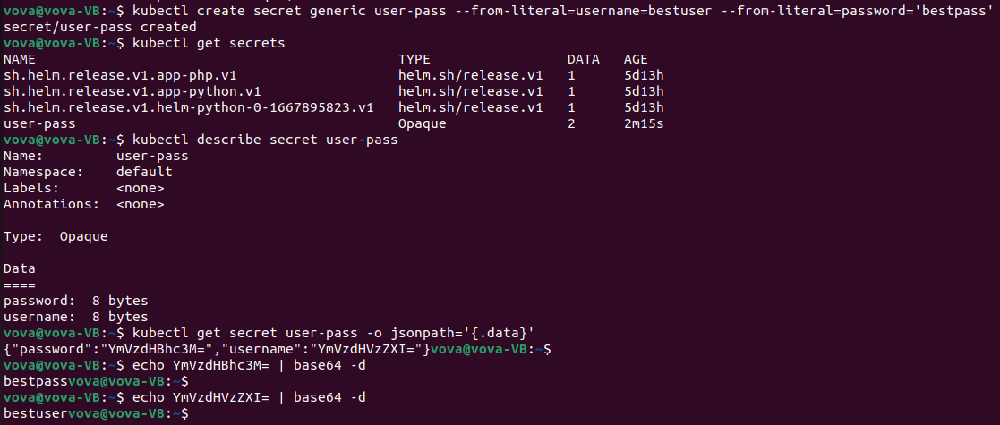
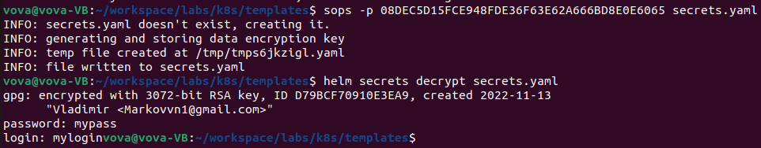
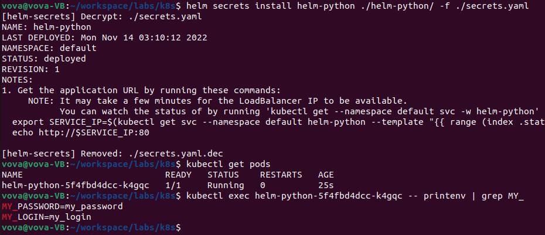
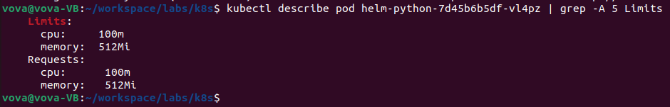

# Lab 11

### Step 2



### Step 3

Install helm plugin and sops:

```bash
helm plugin install https://github.com/jkroepke/helm-secrets

wget https://github.com/mozilla/sops/releases/download/v3.7.3/sops_3.7.3_amd64.deb
sudo apt install ./sops_3.7.3_amd64.deb
```

Generate PGP keys for encryption:

```bash
gpg --gen-key
```

Create secrets.yaml:



Create secrect.yaml in template folder, add env to the deplayments

Run helm chart:

```bash
helm secrets install helm-python ./helm-python/ -f ./secrets.yaml
```



### Step 5



