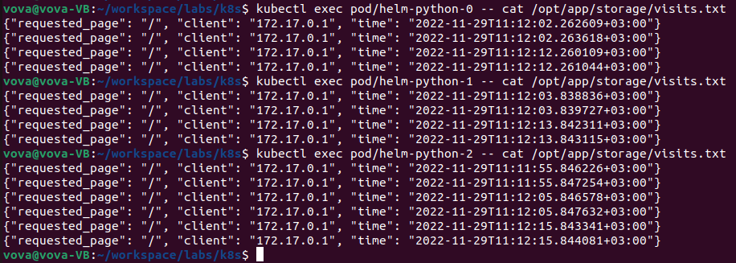
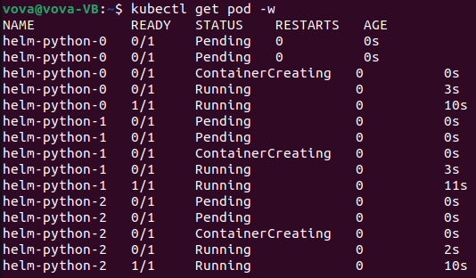

# Lab 13

1. Test updates with command `helm install --dry-run --debug helm-python helm-python`:

   

2. Deploy chart (`helm secrets install helm-python helm-python -f secrets.yaml`):

   

3. Output of `kubectl get po,sts,svc,pvc` command:

   

4. Check the content of your file, in each pod:

   

   After few more requests:

   

5. Describe and explain in the report the differences between the output of the command for replicas

   Each StatefullSet pode stores its own state. As you can see from the output of the command `kubectl get po,sts,svc,pvc`, there are three persistent storage in total. When executing a request in the browser, BalanceLodaer redirects the request to a random node. This is why we can see different visit lists in the browser.

6. For our app ordering guarantee are unnecessary. Describe in the report why

   Each instance of our application is self-contained and independent of the others. So we don't care which node the request is sent to

7. Find a way to tell to the StatefulSet controller to launch or terminate all Pods in parallel. Implement it

   According to the [tutorial](https://kubernetes.io/docs/tutorials/stateful-application/basic-stateful-set/) to tell StatefulSet controller to launch or terminate all Pods in parallel, we need to just add property `podManagementPolicy: "Parallel"`. Let's do it.
   
   Here is how it was before:
   
   
   
   And here is how it is now (all pods were launched in parallel):
   
   

## Bonus

1. Follow the main steps for your extra app:

   

2. Read about update strategies. Describe how did you understand them, kinds and difference

   There are two valid update strategies: `RollingUpdate` and `OnDelete`. 

   > The `RollingUpdate` update strategy will update all Pods in a StatefulSet, in reverse ordinal order, while respecting the StatefulSet guarantees.

   Rolling updates allow deployments to be updated without downtime, replacing old pods with new pods step by step. This allows users to access the application around the clock, and in turn allows developers to deploy new versions of the application several times a day.

   > The `OnDelete` update strategy implements the legacy (1.6 and prior) behavior, When you select this update strategy, the StatefulSet controller will not automatically update Pods when a modification is made to the StatefulSet's `.spec.template` field.

   The update will be carried out if you manually delete existing pods.

   Reference: [link](https://kubernetes.io/docs/tutorials/stateful-application/basic-stateful-set/#updating-statefulsets)